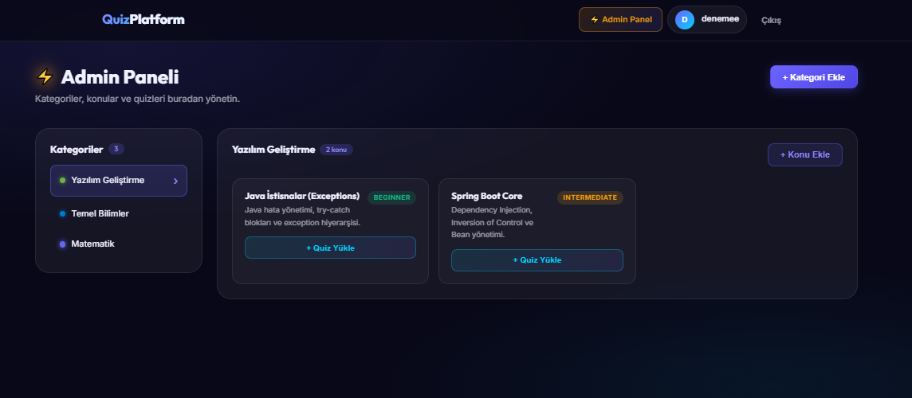
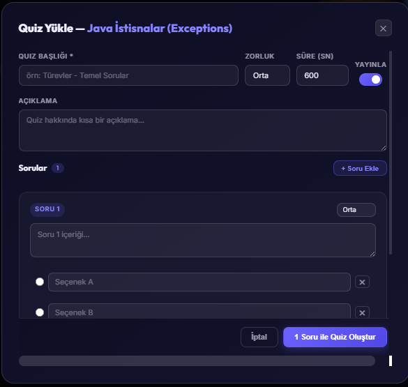
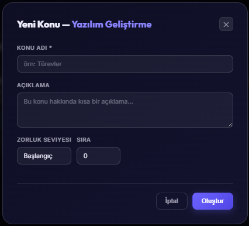
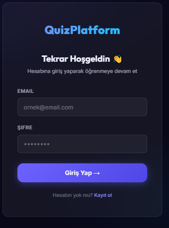
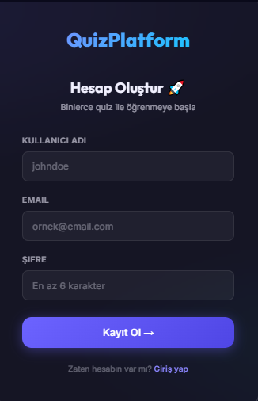
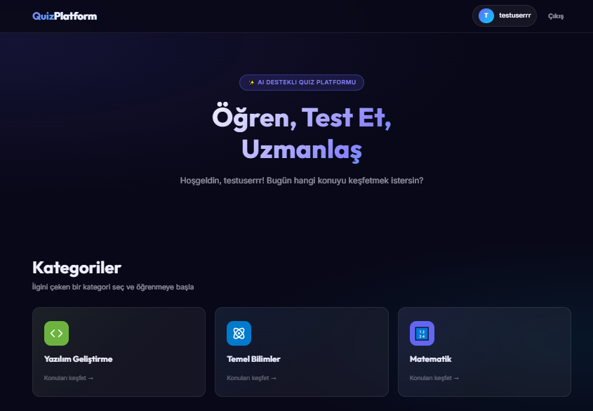
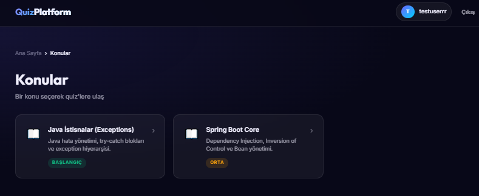
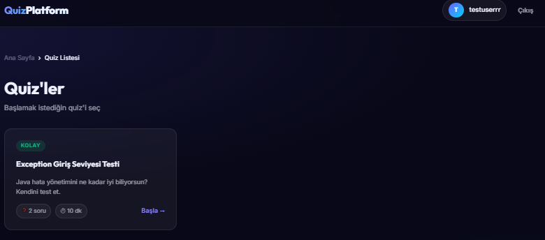
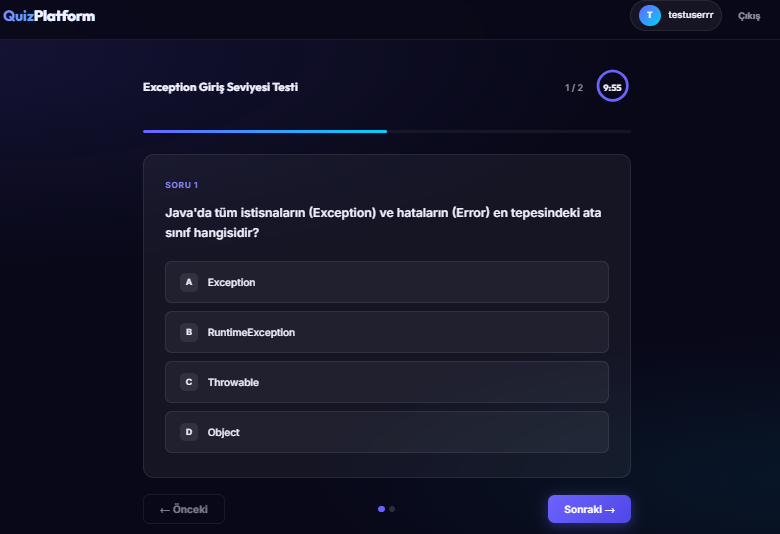
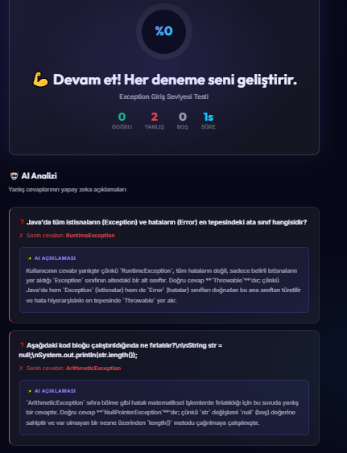

# QuizPlatform - Frontend UI 🎨

[🇹🇷 Türkçe Sürüme Git (Go to Turkish Version)](#türkçe-sürüm)

## 📖 About The Project

QuizPlatform Frontend is a lightning-fast, modern, and interactive user interface built with **React** and **Vite**. It provides a seamless experience for both regular users solving quizzes and administrators managing content. The UI is designed with a custom Glassmorphism aesthetic, completely bypassing heavy UI libraries.

## 💻 Tech Stack

- **Core:** React, TypeScript
- **Build Tool:** Vite (Ultra-fast HMR and optimized builds)
- **Routing:** React Router DOM (Single Page Application architecture)
- **Network:** Axios (Interceptors configured for automatic JWT attachment)
- **Styling:** Custom Vanilla CSS (Glassmorphism, CSS Variables, Flexbox/Grid)
- **Real-time:** Native WebSocket API support (For instant AI feedback)

## ✨ Key Features

- **Full Admin Panel:** A comprehensive dashboard to create and manage Categories, Topics, and dynamic Quizzes with radio-button validation.
- **Interactive Quiz Solving:** Step-by-step quiz attempts with real-time timers and instant score calculation.
- **WebSocket AI Integration:** Live, non-blocking connection to AI services for personalized post-quiz feedback.
- **Secure Routing:** Protected routes (`PrivateRoute`) and Role-based guards (`AdminRoute`) ensure unauthorized users cannot access sensitive pages.
- **Responsive Design:** Fully mobile-compatible grid systems and layouts.

## 📸 Screenshots

### Admin Panel





### Login/Register




### Quiz Solving Interface






### AI Evaluation Result



## 🚀 How to Run

1. Open terminal in the `quizplatform-ui` directory.
2. Install dependencies:
   ```bash
   npm install
   ```
3. Start the development server:
   ```bash
   npm run dev
   ```
4. Access the application at `http://localhost:5173`

---

<a name="türkçe-sürüm"></a>

# QuizPlatform - Frontend Arayüzü 🎨

## 📖 Proje Hakkında

QuizPlatform Frontend, **React** ve **Vite** kullanılarak geliştirilmiş şimşek hızında, modern ve etkileşimli bir kullanıcı arayüzüdür. Hem test çözen normal kullanıcılar hem de içerik yöneten adminler için pürüzsüz bir deneyim sunar. Tasarım, hantal UI kütüphaneleri kullanılmadan tamamen özel olarak kodlanmış _Glassmorphism_ (Cam efekti) estetiğine sahiptir.

## 💻 Kullanılan Teknolojiler

- **Temel:** React, TypeScript
- **Derleyici:** Vite (Çok hızlı anlık yenileme ve optimize edilmiş build)
- **Yönlendirme:** React Router DOM (Tek Sayfa Uygulama mimarisi)
- **Ağ Bağlantısı:** Axios (JWT token'larını otomatik ekleyen interceptor yapısı)
- **Stil:** Özelleştirilmiş Vanilla CSS (Glassmorphism, CSS Değişkenleri, Flexbox/Grid)
- **Gerçek Zamanlı:** Native WebSocket API desteği (Anında yapay zeka geri bildirimi için)

## ✨ Öne Çıkan Özellikler

- **Kapsamlı Admin Paneli:** Kategorileri, konuları ve çoktan seçmeli dinamik quizleri yönetmek için gelişmiş kontrol paneli.
- **Etkileşimli Quiz Çözümü:** Gerçek zamanlı sayaç (timer) ve anında skor hesaplama ile adım adım quiz çözme deneyimi.
- **WebSocket AI Entegrasyonu:** Test bitiminde yapay zekadan kişiselleştirilmiş analiz almak için canlı ve asenkron (bloklamayan) bağlantı.
- **Güvenli Rotalama (Routing):** Korumalı rotalar (`PrivateRoute`) ve Rol tabanlı korumalar (`AdminRoute`) ile yetkisiz erişimlerin engellenmesi.
- **Duyarlı (Responsive) Tasarım:** Mobil cihazlarla tam uyumlu ızgara (grid) ve sayfa düzeni.

## 📸 Ekran Görüntüleri

### Admin Paneli


### Giriş/Kayıt


### Quiz Çözme Ekranı


### Yapay Zeka Sonuç Ekranı


## 🚀 Nasıl Çalıştırılır?

1. Terminali `quizplatform-ui` dizininde açın.
2. Gerekli kütüphaneleri indirin:
   ```bash
   npm install
   ```
3. Geliştirici sunucusunu başlatın:
   ```bash
   npm run dev
   ```
4. Uygulamaya `http://localhost:5173` adresinden erişin.
